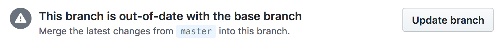

# Keeping your branch up-to-date

When working with other developers, it can be that the branch your are working on becomes out of sync with the base
branch. In your Github PR your will see the following message:



If this happens, you need to retrieve all the changes from upstream, and apply them to your branch by rebasing it on top of master.

1. Open Terminal.

1. Change the current working directory to your local project.

1. Sync up your fork with `upstream`.
```bash
git checkout master
git pull upstream master
git push origin master
```

2. Rebase your branch.
```bash
git checkout -
git rebase master
```

3. Update your branch.
```bash
git push origin -f
```

## Github help links

* [Syncing a fork](https://help.github.com/articles/syncing-a-fork/)
* [Pushing to a remote](https://help.github.com/articles/pushing-to-a-remote/)
