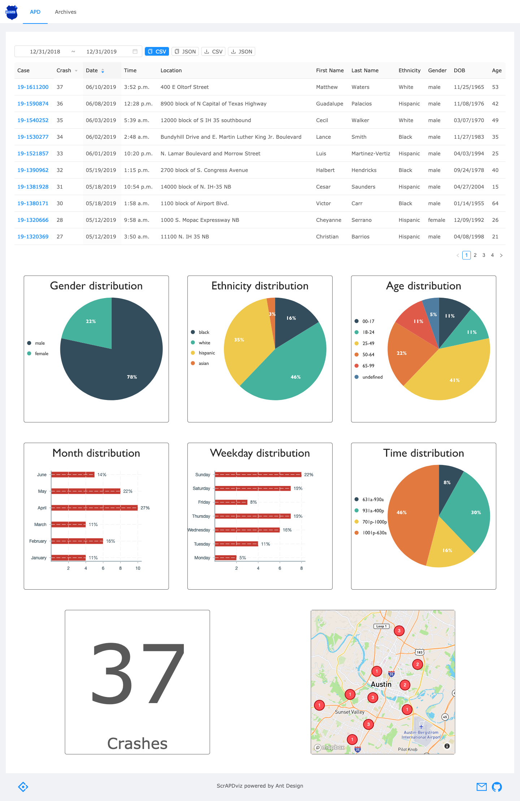

# ScrAPD

ScrAPD is a collection of tools to automatically collect information about traffic fatalities in the city of Austin, TX and render it on a modern dashboard.

The goal of the project is to help grassroots organizations, local communities and individuals advocate in favor of the [Vision Zero] program.

We believe that representing this information on graphs and maps helps people better understand the importance of this plague and feel more involved to address the issue.

[//]: #
[Vision Zero]: https://austintexas.gov/visionzero
